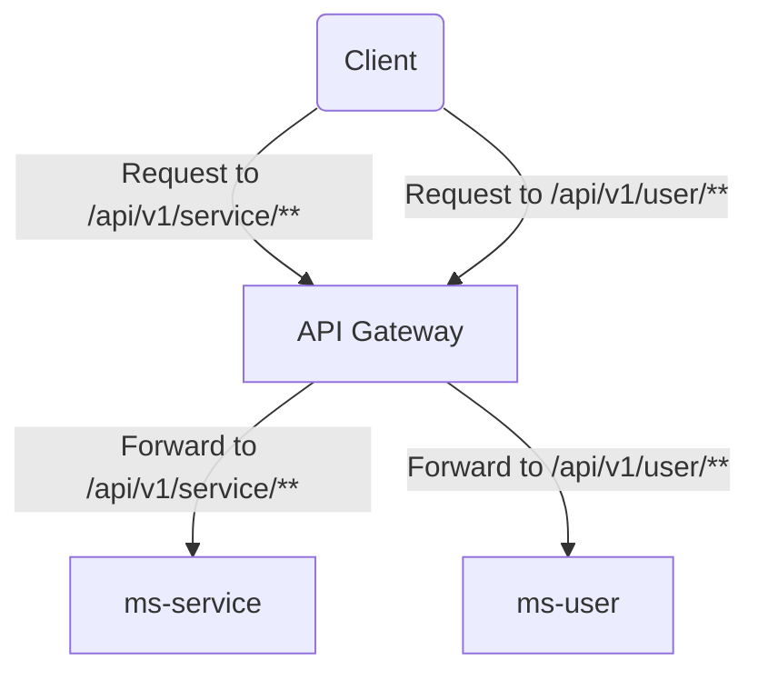

# Microservice Load Balancer

Este proyecto implementa un **load balancer** utilizando Spring Cloud Gateway para enrutar las solicitudes hacia diferentes microservicios.

## Servicios

El `ms-gateway` actúa como el **API Gateway** y balanceador de carga para los siguientes microservicios:

- **ms-service**: Maneja las solicitudes relacionadas con los servicios en la ruta `/api/v1/service/**`.
- **ms-user**: Maneja las solicitudes relacionadas con los usuarios en la ruta `/api/v1/user/**`.

### Configuración del Gateway

El archivo de configuración (`application.yml`) del Gateway define las rutas hacia los diferentes microservicios utilizando el patrón de balanceo de carga `lb://` (load balancer). A continuación, se muestra el contenido del archivo:

```yaml
server:
  port: 8761
spring:
  application:
    name: ms-gateway

  cloud:
    gateway:
      mvc:
        routes:
          - id: service
            uri: lb://ms-service
            predicates:
              - Path=/api/v1/service/**

          - id: user
            uri: lb://ms-user
            predicates:
              - Path=/api/v1/user/**
```

### Diagrama de arquitectura

El siguiente diagrama muestra cómo el **API Gateway** enruta las solicitudes a los microservicios `ms-service` y `ms-user` según los patrones de URL:



### Endpoints

- **`/api/v1/service/**`**: Todas las solicitudes con este patrón serán enrutadas al microservicio `ms-service`.
- **`/api/v1/user/**`**: Todas las solicitudes con este patrón serán enrutadas al microservicio `ms-user`.

### Ejecución

Para ejecutar los servicios y el gateway, utiliza el siguiente comando desde la raíz del proyecto donde está definido el `docker-compose.yml`:

```bash
docker-compose up --build
```

Esto construirá y ejecutará los contenedores para los servicios `ms-gateway`, `ms-service`, y `ms-user`.

### Contribuciones

Si encuentras algún problema o deseas contribuir a este proyecto, por favor, abre un issue o crea un pull request.

---

### Recursos adicionales

- [Spring Cloud Gateway Documentation](https://spring.io/projects/spring-cloud-gateway)
- [Spring Cloud LoadBalancer](https://spring.io/projects/spring-cloud-loadbalancer)
